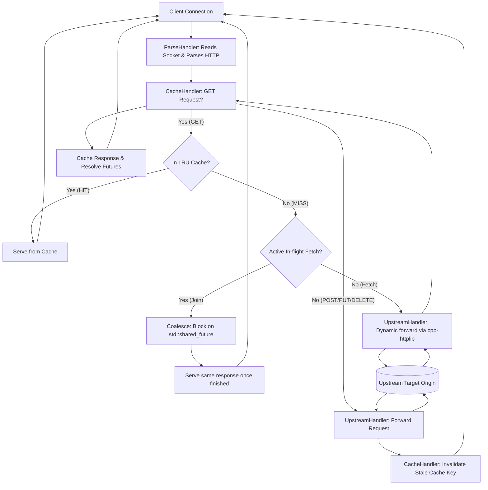

# C++17 Caching Reverse Proxy Server

A multi-threaded Caching Reverse Proxy Server implemented in C++17. Designed as an intermediate gateway, this server intercepts client HTTP/1.1 requests, inspects a thread-safe Sharded LRU Cache to serve cached responses instantly, coalesces concurrent requests targeting the same upstream resource to mitigate backend stampede, and dynamically routes cache misses to secure HTTPS or plain HTTP target origins.

---

## 🛠️ System Architecture & Design Patterns

The server is built with modern systems programming patterns to ensure high throughput, safety, and strict correctness under heavy concurrent workloads:




### 📋 Architectural & System Design Patterns

| System Design Pattern | Component in Code | Core Feature & Purpose |
| :--- | :--- | :--- |
| **Chain of Responsibility** | [`Middleware`](file:///home/rajdeep/proxyserver/caching-proxy/include/middleware/Middleware.hpp), [`ParseHandler`](file:///home/rajdeep/proxyserver/caching-proxy/src/middleware/ParseHandler.cpp), [`CacheHandler`](file:///home/rajdeep/proxyserver/caching-proxy/src/middleware/CacheHandler.cpp), [`UpstreamHandler`](file:///home/rajdeep/proxyserver/caching-proxy/src/middleware/UpstreamHandler.cpp) | Models request processing as sequential modular handlers (parsing -> caching -> fetching), allowing clean decoupling of pipeline steps. |
| **Singleton** | [`Logger`](file:///home/rajdeep/proxyserver/caching-proxy/src/logger/Logger.cpp) | Ensures a single globally accessible logging instance across the multithreaded server to coordinate safe concurrent writes to the file stream. |
| **Thread Pool** | [`ThreadPool`](file:///home/rajdeep/proxyserver/caching-proxy/src/concurrency/ThreadPool.cpp) | Manages a fixed size worker pool to queue and execute client socket connections, avoiding thread creation overhead and system exhaustion. |
| **Cache Sharding (Data Partitioning)** | [`ShardedCache`](file:///home/rajdeep/proxyserver/caching-proxy/src/cache/ShardedCache.cpp) | Splits the cache into 12 distinct shards and hashes key routes to prevent global lock contention in multithreaded readers/writers. |
| **Request Coalescing (Future/Promise)** | [`RequestCoalescer`](file:///home/rajdeep/proxyserver/caching-proxy/src/network/RequestCoalescer.cpp) | Dedupes concurrent uncached hits (thundering herd protection) by letting the first thread retrieve data while others block on a `std::shared_future`. |
| **Observer (Publish-Subscribe)** | [`RequestCoalescer`](file:///home/rajdeep/proxyserver/caching-proxy/src/network/RequestCoalescer.cpp) | The coalescing waiters are notified and wake up as soon as the fetcher thread completes the `std::promise`, resolving the future response. |
| **RAII (Resource Acquisition Is Initialization)** | `std::lock_guard` | Automatically handles mutex locking and unlocking via scope boundaries, ensuring zero deadlock conditions on exceptions or premature returns. |

---

### 1. Multi-threaded Worker Pool (`ThreadPool`)
Instead of spawning a thread per TCP connection (which wastes resources and adds context-switching overhead), the server pre-allocates a fixed-size worker pool based on hardware capability. Incoming connections accepted by the main thread are enqueued onto a thread-safe queue. Idle threads wake up to process connections, ensuring bounded resource consumption.

### 2. Lock-Contention Mitigation (`ShardedCache`)
A single global cache guarded by a single mutex is a major bottleneck under high concurrency. To mitigate lock contention, the cache is partitioned into **12 independent shards**. Requests are routed to a specific shard using the hash of their URL key, enabling concurrent threads to read and write without blocking each other.

### 3. Thundering Herd Protection (`RequestCoalescer`)
To prevent cache stampedes (when multiple clients request an uncached resource simultaneously), the proxy implements **Request Coalescing**. Using C++17 `std::promise` and `std::shared_future`, only the first request (the owner) fetches from the backend. Concurrent waiters block on the shared future and are served the response directly from memory once the owner completes, shielding the backend server.

### 4. Zero-Copy Incremental Stream Parsing (`picohttpparser`)
HTTP headers may arrive fragmented across network packets. The server utilizes `picohttpparser` in an incremental socket-reading loop to correctly handle partial packet header fragmentation with zero-copy speeds.

### 5. Dynamic Cache Invalidation & Force Cache
*   **Automatic Cache Invalidation**: The proxy intercepts writes (`POST`, `PUT`, `PATCH`, `DELETE`). Successful mutations automatically trigger immediate cache invalidation of the target resource, keeping cached data consistent.
*   **Enforced Minimum TTL**: The proxy supports overriding target `Cache-Control` restrictions (like `no-cache`, `private`, or `max-age=0`) to guarantee successful responses are cached for at least 60 seconds (or a configurable TTL), optimizing backend resource utilization.

---

## 📂 Project Structure

The codebase is highly modularized, separating declarations, implementations, and vendor libraries:

```text
caching-proxy/
├── CMakeLists.txt              # CMake build configuration
├── Dockerfile                  # Multi-stage optimized Docker compiler build
├── docker-compose.yml          # Container configuration with host volume mappings
├── README.md                   # Project documentation
├── ProxyServerLog.log          # Persisted proxy log file (mounted)
├── config/
│   ├── config.hpp              # Global configuration variables (TTL, port, timeouts)
│   └── config.cpp
├── include/                    # Header declarations
│   ├── cache/
│   │   ├── CacheStrategy.hpp   # ICache interface definition
│   │   ├── LRUCache.hpp        # Thread-safe LRU cache shard
│   │   └── ShardedCache.hpp    # Multi-shard cache manager
│   ├── concurrency/
│   │   └── ThreadPool.hpp      # Worker pool infrastructure
│   ├── error/
│   │   └── ErrorHandler.hpp    # Standardized proxy exceptions
│   ├── logger/
│   │   └── Logger.hpp          # Thread-safe singleton logging wrapper
│   ├── middleware/
│   │   ├── Middleware.hpp      # Chain of Responsibility base
│   │   ├── ParseHandler.hpp    # Read, parse, and commit responses
│   │   ├── CacheHandler.hpp    # Cache checks, hits, misses & invalidations
│   │   └── UpstreamHandler.hpp # Downstream client request forwarding
│   ├── network/
│   │   └── HttpContext.hpp     # HTTP context (Request, Response, Socket state)
│   ├── utils/
│   │   └── http_utils.hpp      # HTTP serialization, normalizing, and parsing
│   └── vendor/                 # Embedded dependencies
│       ├── httplib.h           # cpp-httplib client
│       └── picohttpparser.h    # picohttpparser C library
└── src/                        # Implementations
    ├── cache/
    │   ├── LRUCache.cpp
    │   └── ShardedCache.cpp
    ├── concurrency/
    │   └── ThreadPool.cpp
    ├── error/
    │   └── ErrorHandler.cpp
    ├── logger/
    │   └── Logger.cpp
    ├── middleware/
    │   ├── ParseHandler.cpp
    │   ├── CacheHandler.cpp
    │   └── UpstreamHandler.cpp
    ├── utils/
    │   └── http_utils.cpp
    └── vendor/
        └── picohttpparser.c
```

---

## 🚀 Running with Docker (Recommended)

Docker Compose is the simplest way to run the proxy. It automatically compiles the codebase, handles volumes, configures ports, and syncs timezone details.

### Fast Local Execution
1.  **Start the proxy targeting an origin site:**
    ```bash
    ORIGIN=https://news.ycombinator.com docker compose up --build
    ```
    *   **Port Mapping**: The proxy server will listen on port `8080` of your host.
    *   **Timezone Sync**: Automatically mounts `/etc/localtime` and maps the container timezone to your host's clock.
    *   **Logs**: Saves logs in real-time to `./ProxyServerLog.log`.

2.  **Stop the proxy:**
    ```bash
    docker compose down
    ```

### Inside the Multi-Stage Dockerfile
*   **Dependency Caching**: Installs and compiles heavy external libraries (like `sockpp`) in an isolated, cached container layer. Subsequent code modifications rebuild in **2-3 seconds** instead of minutes.
*   **Slim Runtime**: Copies the built executable and OpenSSL libraries to `debian:bookworm-slim` for a minimal, production-safe runtime footprint.

---

## 🛠️ Building & Running Locally

If you prefer building on your local machine (outside of Docker), ensure you have a C++17 compiler, CMake, and OpenSSL libraries.

### Prerequisites (Ubuntu/Debian)
```bash
sudo apt update && sudo apt install -y build-essential cmake libssl-dev
```

### Build Steps
```bash
# 1. Configure the build
cmake -B build -S .

# 2. Build the executable
cmake --build build
```

### Run Command
```bash
./build/caching-proxy --port <port> --origin <target_origin_url>
```
**Example:**
```bash
./build/caching-proxy --port 3000 --origin http://dummyjson.com
```

#### Log Level Filtering
You can control the server's logging verbosity using the `LOG_LEVEL` environment variable. Supported values are `DEBUG`, `INFO`, `WARNING`, and `ERROR` (defaults to `INFO`):
```bash
LOG_LEVEL=WARNING ./build/caching-proxy --port 8080 --origin http://localhost:9001
```
*Tip: Under heavy benchmark workloads (e.g., using `wrk`), setting `LOG_LEVEL=WARNING` or `LOG_LEVEL=ERROR` avoids logging bottlenecks and increases performance.*

---

## 🧪 Verification & API testing

Once the server is running on `http://localhost:8080`, test its core behaviors with `curl`:

### 1. GET requests & Forced Cache (Hacker News test)
Hacker News uses `cache-control: private, max-age=0` to prevent caching. Our proxy overrides this and forces it to be cached for at least 60 seconds.

*   **First Request (Cache Miss):**
    ```bash
    curl -i http://localhost:8080/
    ```
    *Logs show:* `[CACHE MISS] GET https://news.ycombinator.com/`

*   **Second Request (Cache Hit):**
    ```bash
    curl -i http://localhost:8080/
    ```
    *Logs show:* `[CACHE HIT] GET https://news.ycombinator.com/` (instantaneous response)

### 2. POST / PUT Dynamic Method & Payload Forwarding
Send a write request with custom client headers and a JSON body. The proxy will dynamically preserve the HTTP method, forward your headers and payload, and return the backend's response transparently.

```bash
curl -i -X POST http://localhost:8080/posts \
  -H "Content-Type: application/json" \
  -H "X-Custom-Client-Header: Hello" \
  -d '{"title": "C++ Caching Proxy", "body": "check", "userId": 1}'
```

### 3. PUT Cache Invalidation
When you modify a resource, the cache must be invalidated.

1.  Query `GET /posts/1` -> `[CACHE MISS]` (Fills cache).
2.  Query `GET /posts/1` -> `[CACHE HIT]`.
3.  Send a `PUT` request to update `/posts/1`:
    ```bash
    curl -i -X PUT http://localhost:8080/posts/1 \
      -H "Content-Type: application/json" \
      -d '{"id": 1, "title": "Updated Title", "body": "fresh data", "userId": 1}'
    ```
4.  Query `GET /posts/1` -> `[CACHE MISS]`. *(The cache was wiped when the PUT succeeded!)*

### 4. Load Benchmarking with `wrk`

You can perform high-concurrency benchmarks on the caching proxy using the [wrk](https://github.com/wg/wrk) HTTP benchmarking tool.

#### Prerequisites
Install `wrk` on Ubuntu/Debian:
```bash
sudo apt update && sudo apt install -y wrk
```

#### Step-by-Step Benchmarking

1. **Start a simple origin server** on port `9001` (e.g. using Python's static server):
   ```bash
   mkdir -p /tmp/backend && echo "Hello from Origin!" > /tmp/backend/index.html
   python3 -m http.server 9001 --directory /tmp/backend
   ```

2. **Start the Caching Proxy** targeting the origin:
   ```bash
   # Run with LOG_LEVEL=WARNING to prevent verbose logger lock bottlenecks during high concurrency
   LOG_LEVEL=WARNING ./build/caching-proxy --port 8080 --origin http://localhost:9001
   ```

3. **Run the benchmark**:
   Run `wrk` with multiple threads and connections:
   ```bash
   # Benchmark with 12 threads and 400 connections over 30 seconds
   wrk -t12 -c400 -d30s -H "Connection: close" http://localhost:8080/index.html
   ```
   *Note: Using `-H "Connection: close"` is recommended under heavy simulated concurrency to ensure threads are recycled and returned to the thread pool, rather than being pinned to idle sockets.*

